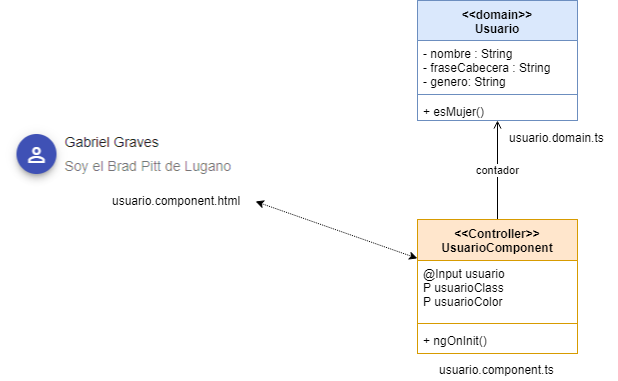
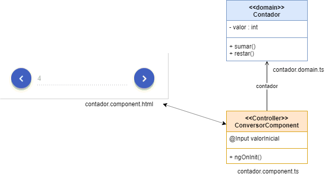
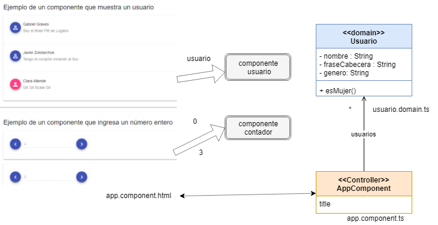

# Componentes reutilizables de Angular

[](https://travis-ci.org/uqbar-project/eg-componentes-angular)


Este proyecto fue generado con [Angular CLI](https://github.com/angular/angular-cli) version 6.0.0.


## Creación de componentes con Angular CLI

Generamos dos componentes con la interfaz de línea de comandos de Angular

```bash
fernando@dodain ~/workspace/angular-2018/eg-componentes-angular $ ng generate component contador
CREATE src/app/contador/contador.component.css (0 bytes)
CREATE src/app/contador/contador.component.html (27 bytes)
CREATE src/app/contador/contador.component.spec.ts (642 bytes)
CREATE src/app/contador/contador.component.ts (277 bytes)
UPDATE src/app/app.module.ts (404 bytes)
fernando@dodain ~/workspace/angular-2018/eg-componentes-angular $ ng generate component usuario
CREATE src/app/usuario/usuario.component.css (0 bytes)
CREATE src/app/usuario/usuario.component.html (26 bytes)
CREATE src/app/usuario/usuario.component.spec.ts (635 bytes)
CREATE src/app/usuario/usuario.component.ts (273 bytes)
UPDATE src/app/app.module.ts (490 bytes)
```

Como vemos, todo componente tiene una estructura similar a una aplicación Angular, solo que sin el módulo. Quedan entonces estos archivos:

- **vista**: archivo xxx.component.html
- **modelo de vista**: xxx.component.ts
- **archivo de estilos**: xxx.component.css
- **testing unitario**: xxx.component.spec.ts


## Agregando Material Design para Angular

```bash
$ npm install --save @angular/material @angular/cdk
```

En https://material.angular.io/ podrán encontrar tips para incoporar componentes de Angular para trabajar, en particular en la página [getting started](https://material.angular.io/guide/getting-started). 

# Componente que muestra un usuario 

## Vista html

El primer componente reutilizable es un usuario que se visualiza en una Card de Material 

- tenemos un avatar con fondo rosa o azul en base al género
- el título con el nombre completo
- el subtítulo con una frase de cabecera

Eso lo definimos en nuestra vista usuario.component.html:

```html
<mat-card class="example-card">
  <mat-card-header>
    <div mat-card-avatar class="example-header-image">
      <button mat-mini-fab color="{{usuarioColor}}">
        <i class="material-icons">person{{usuarioClass}}</i>
      </button>
    </div>
    <mat-card-title>{{usuario.nombre}}</mat-card-title>
    <mat-card-subtitle>{{usuario.fraseCabecera}}</mat-card-subtitle>
  </mat-card-header>
</mat-card>
```

## Modelo de la vista

No tenemos binding bidireccional (_two-way_), sino que únicamente estaremos mostrando los datos de un usuario y nos ayudan dos propiedades usuarioClass y usuarioColor que define el modelo de la vista (ya que el objeto de dominio no debe estar atado a cuestiones tecnológicas). El archivo asociado para el modelo de la vista es usuario.component.ts:

```typescript
export class UsuarioComponent implements OnInit {

  @Input() usuario : Usuario

  get usuarioClass() {
    return this.usuario.esMujer() ? "" : "_outline"
  }

  get usuarioColor() {
    return this.usuario.esMujer() ? "accent" : "primary"
  }
```

Algunas observaciones:

- tanto usuarioClass como usuarioColor lo definimos como properties de solo lectura mediante el prefijo get (esto hace que no lo invoquemos con paréntesis sino como si fueran atributos del objeto)

- el usuario no vamos a instanciarlo desde cero, sino que lo vamos a pasar como **input**, por eso aparece la annotation @Input. Esto permite que lo llamemos desde la vista principal, dentro de un for que arma una lista de usuarios:

```html
  <mat-card-content>
    <div *ngFor='let usuario of usuarios'>
      <app-usuario [usuario]="usuario"></app-usuario>
    </div>
  </mat-card-content>
```

`[usuario]=usuario` está marcando que pasaremos al componente el objeto de dominio usuario para cada uno de los elementos de la colección de usuarios, que debemos inicializar en el modelo del componente principal (app.component.ts):

```typescript
export class AppComponent {
  title = 'app'
  usuarios = [
        new Usuario("Gabriel Graves", "Soy el Brad Pitt de Lugano", Usuario.MASCULINO),
        new Usuario("Javier Zolotarchuk", "Tengo el corazón mirando al Sur...", Usuario.MASCULINO),
        new Usuario("Clara Allende", "Git Git Scala Git", Usuario.FEMENINO)
    ]
}
```

## Objeto de dominio Usuario

El objeto Usuario es más bien simple, agrupa propiedades, define constantes de género y un método para saber si es mujer:

```typescript
export class Usuario {
    static readonly FEMENINO = "F"
    static readonly MASCULINO = "M"

    nombre : string
    fraseCabecera : string
    genero : string

    constructor(nombre, fraseCabecera, genero) {
        this.nombre = nombre
        this.fraseCabecera = fraseCabecera
        this.genero = genero
    }

    esMujer() {
        return this.genero === Usuario.FEMENINO
    }

}
```

Vemos un resumen de la arquitectura:



## Agregados de Material

Para incorporar elementos de Material debemos:

- agregar en el archivo index.html la referencia al css de Material

```html
<html lang="en">
<head>
  <meta charset="utf-8">
  <title>Componentes genéricos de Angular</title>
  <link href="https://fonts.googleapis.com/icon?family=Material+Icons" rel="stylesheet" type="text/css">
```

- en el archivo app.module.ts agregar los imports en la definición del módulo

```typescript
/** Imports de Material */
import {BrowserAnimationsModule} from '@angular/platform-browser/animations';
import {MatButtonModule, MatFormFieldModule, MatInputModule, MatCardModule} from '@angular/material';

@NgModule({
  declarations: [
    AppComponent,
    ContadorComponent,
    UsuarioComponent
  ],
  imports: [
    BrowserModule,
    BrowserAnimationsModule,
    MatButtonModule,
    MatFormFieldModule,
    MatInputModule,
    MatCardModule
  ],
```

- y por último incorporar el tema de Material en el archivo raíz styles.css

```css
/* You can add global styles to this file, and also import other style files */
@import "~@angular/material/prebuilt-themes/indigo-pink.css";
```

Esto permite que los podamos usar dentro de las vistas.

# Componente contador

El contador es un ejemplo es muy simple, pero muestra la independencia del scope de variables de los componentes de Angular. En la vista principal de la aplicación, definimos dos contadores, cada uno con diferente valor inicial. En el archivo app.component.html escribimos:

```html
<mat-card>
  <mat-card-title>
    Ejemplo de un componente que ingresa un n&uacute;mero entero
  </mat-card-title>
  <mat-card-content>
    <app-contador valorInicial="3"></app-contador>
    <br>
    <app-contador valorInicial="0"></app-contador>
  </mat-card-content>
</mat-card>
```

Por lo tanto ya sabemos que nuestro @Input debe ser un valor inicial. Pero además, vamos a trabajar con un objeto de dominio contador, al que vamos a poder sumar o restarle un número (contador.domain.ts):

```typescript
export class Contador {
    valor = 0

    constructor(valorInicial : number) {
        this.valor = valorInicial
    }

    sumar() {
        this.valor++
    }

    restar() {
        this.valor--
    }
}
```

El componente principal va a inicializar el contador cuando reciba el valor inicial. Y esto lo hace en el momento de la inicialización, dentro del método ngOnInit (contador.component.ts):

```typescript
export class ContadorComponent implements OnInit {

  @Input() valorInicial : number
  contador : Contador
  
  constructor() { }

  ngOnInit() {
    this.contador = new Contador(this.valorInicial)
  }
}
```

Así se construye el contador que va a ser el modelo de la vista. Aquí tendremos:

- _buttons_ que disparan actualizaciones al modelo (ver la propiedad _click_)...
- ...y un binding del modelo a la vista del input que muestra el valor actual del contador (deshabilitado para el usuario, ver la propiedad _value_ que utiliza el _moustache_ contador.valor)

Esto lo vemos en la vista contador.component.html:

```html
<mat-card>
    <button mat-mini-fab color="primary" (click)="contador.restar()">
        <i class="material-icons">keyboard_arrow_left</i>
    </button>
    <mat-form-field class="example-full-width">
        <input matInput disabled value="{{contador.valor}}">
    </mat-form-field>
    <button mat-mini-fab color="primary" (click)="contador.sumar()">
        <i class="material-icons">keyboard_arrow_right</i>
    </button>
</mat-card>
```

Lo interesante es que pueden coexistir dos componentes app-contador, cada una con su propio valor en el modelo.

Vemos el gráfico general de la solución en Angular:



# Componente principal

Como hemos visto anteriormente el componente principal pasa

- cada parámetro de la lista de usuarios como input del componente de usuarios
- un valor inicial como input al componente contador



# Testing

## Usuario

Hay un solo test relevante para contar respecto al usuario: el componente debe mostrar un ícono de color rosa en el caso del género femenino:

```typescript
  it('a woman should appear with a rose icon', () => {
    fixture.detectChanges()
    const result = fixture.debugElement.nativeElement
    expect(result.querySelector(".mat-accent")).toBeTruthy()
  })
```

El método toBeTruthy() busca que exista un elemento html con una clase _mat-accent_ que equivale al color rosa de Material Angular. Claramente, los tests son más que unitarios, y están atados a los componentes visuales que estemos utilizando.

## Contador

Además de los típicos controles de creación de componente, en los tests validamos

- que se pueda pasar un valor inicial como input: se debe visualizar en el input
- pasar un valor e incrementar uno el contador: se debe visualizar el nuevo valor en el input
- pasar un valor y decrementar uno el contador: se debe visualizar el nuevo valor en el input

Esto naturalmente está en el archivo _usuario.component.spec.ts_:

```typescript
  it('initial value should be 5 if setted', () => {
    component.valorInicial = 5
    component.ngOnInit()
    fixture.detectChanges()
    fixture.whenStable().then(() => {
      const result = fixture.debugElement.nativeElement
      expect(result.querySelector("#contador").value).toEqual("5")
      })
  })
  it('initial value should increase if plus button clicked', () => {
    component.valorInicial = 5
    component.ngOnInit()
    const result = fixture.debugElement.nativeElement
    result.querySelector("#sumar").click()
    fixture.detectChanges()
    fixture.whenStable().then(() => {
      expect(result.querySelector("#contador").value).toEqual("6")
      })
  })
```

Para poder construir el objeto Contador y pasarle el valor inicial, debemos invocar manualmente al evento ngOnInit() del componente. Por otra parte, el método whenStable() del fixture nos devuelve una _promise_, que cuando terminen de ejecutarse los eventos de inicialización ejecutará el bloque que le pasemos como parámetro (en este caso, verificar que el contador tiene el nuevo valor).

## Componente padre

Por último, el componente padre también tiene su propio conjunto de tests, aunque al delegar principalmente a los componentes hijos, no son pruebas interesantes para contar (simplemente que se pueda crear correctamente el componente).
