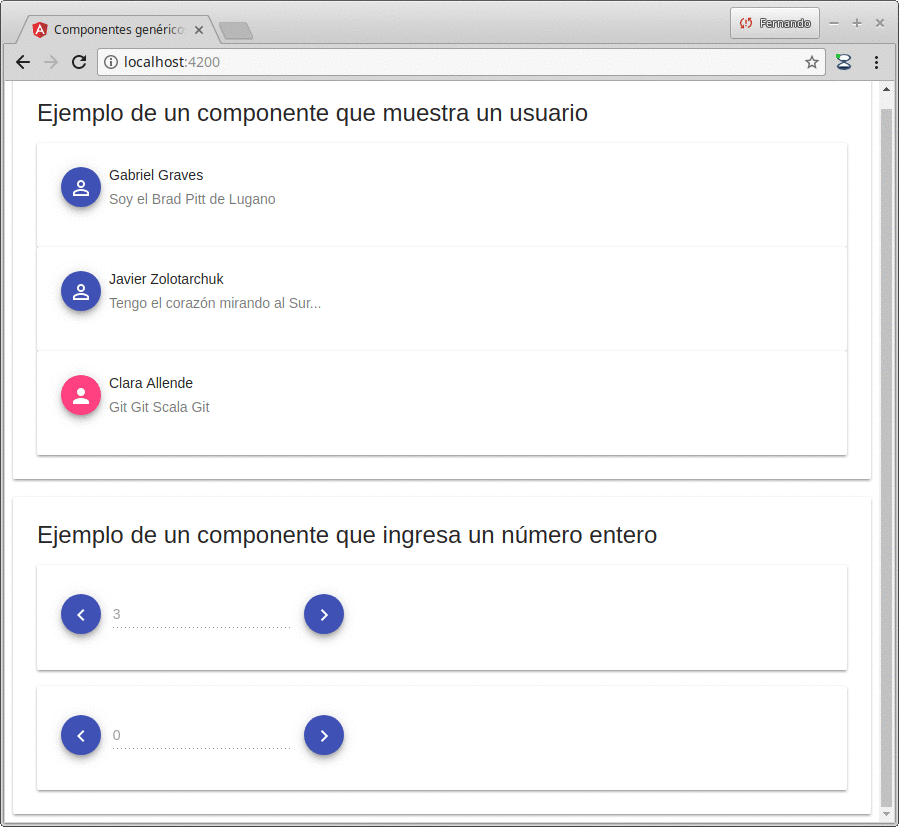

# Componentes reutilizables de Angular



Este proyecto fue generado con [Angular CLI](https://github.com/angular/angular-cli) version 6.0.0.

## Development server

Run `ng serve` for a dev server. Navigate to `http://localhost:4200/`. The app will automatically reload if you change any of the source files.


## Creación de componentes con Angular CLI

Los componentes se generan con la interfaz de línea de comandos de Angular

```bash
fernando@dodain ~/workspace/angular-2018/eg-componentes-angular $ ng generate component contador
CREATE src/app/contador/contador.component.css (0 bytes)
CREATE src/app/contador/contador.component.html (27 bytes)
CREATE src/app/contador/contador.component.spec.ts (642 bytes)
CREATE src/app/contador/contador.component.ts (277 bytes)
UPDATE src/app/app.module.ts (404 bytes)
fernando@dodain ~/workspace/angular-2018/eg-componentes-angular $ ng generate component usuario
CREATE src/app/usuario/usuario.component.css (0 bytes)
CREATE src/app/usuario/usuario.component.html (26 bytes)
CREATE src/app/usuario/usuario.component.spec.ts (635 bytes)
CREATE src/app/usuario/usuario.component.ts (273 bytes)
UPDATE src/app/app.module.ts (490 bytes)
```

Como vemos, todo componente tiene una estructura similar a una aplicación Angular, solo que sin el módulo. Quedan entonces estos archivos:

## Agregando Material Design para Angular

https://material.angular.io/

```bash
$ npm install --save @angular/material @angular/cdk
```


Seguir las instrucciones de https://material.angular.io/guide/getting-started, en particular agregar a styles.css

